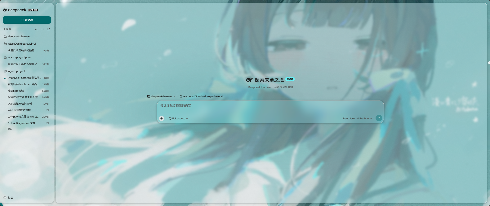

# 琉璃 · dsh-liuli-ui-enhance

<div align="center">

[GitHub](https://github.com/LilycleHeart/dsh-liuli-ui-enhance) ｜ [简体中文](README.md) ｜ [English](README_EN.md)

<br>


<br>
<br>

DeepSeek Harness 的 **Material Design 3 × Fluent 2 融合主题**插件：动态取色、壁纸磨砂、声纹可视化、Dockable 工作台。

</div>

## 截图



## 特性

- 🎨 M3 动态取色
- 🖼️ 壁纸与磨砂材质
- 🔊 声纹可视化
- 🌗 日/夜切换
- 🧩 Dockable 工作台
- 🖥️ 右侧边栏
- ⚡ 详细页自动展开（模型写文件/git 操作时自动展示审查面板）
- 🌐 内嵌浏览器
- 🚀 侧边栏浏览器自动驱动（模型启动 dev server / 写前端文件时自动展示页面；agent `open --show` 驱动即可见）
- 🎛️ 无边框窗口按钮
- 🎯 元素选择器
- 🔍 开发者工具（悬浮球，Electron 侧边 DevTools）
- ⚙️ 设置「外观」「功能」两个分区（外观：取色/背景/材质/圆角/泛光/壁纸等；功能：宽边/动画/声纹/模型重试/历史加载/非官方增强开关）
- 🤝 非官方增强兼容开关（与其它插件冲突时一键关闭侵入式/观察式功能，保留官方扩展点上的主题能力）

完整功能见 [docs/features.md](docs/features.md)。

## 安装

> 前置条件：已安装 [Node.js](https://nodejs.org) 20+ 与 [pnpm](https://pnpm.io/installation)，
> 且启动过一次 DSH Desktop（首次启动会生成 `~/.dsh/profiles/desktop`）。

```bash
pnpm install            # 首次：安装依赖并构建 lib/（install:desktop 也会自动补这步）
pnpm install:desktop
pnpm patch:desktop      # 推荐：win32 无边框补丁（自动补丁失败不阻断插件）
```

> 插件尚未发布到 npm，DSH 内置市场也不接受 GitHub 安装目标；请使用本仓库的
> `pnpm install:desktop` 手动安装。

详见 [docs/install.md](docs/install.md)。

## 文档

- [功能详解](docs/features.md)
- [样式规范](docs/style-guide.md)
- [安装与构建](docs/install.md)
- [浏览器自动化](docs/browser-use.md)

## License

MIT
