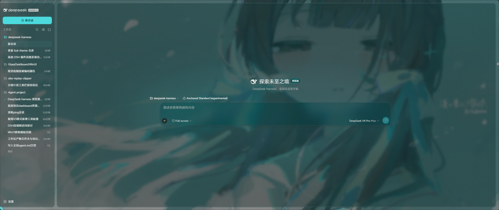
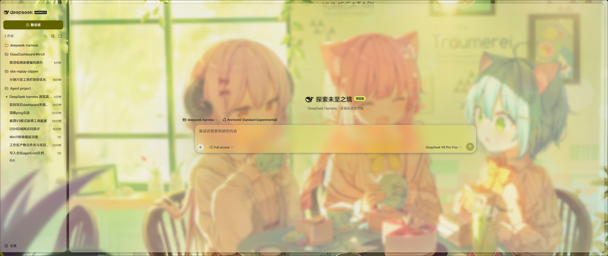
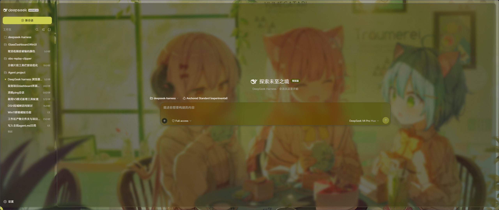
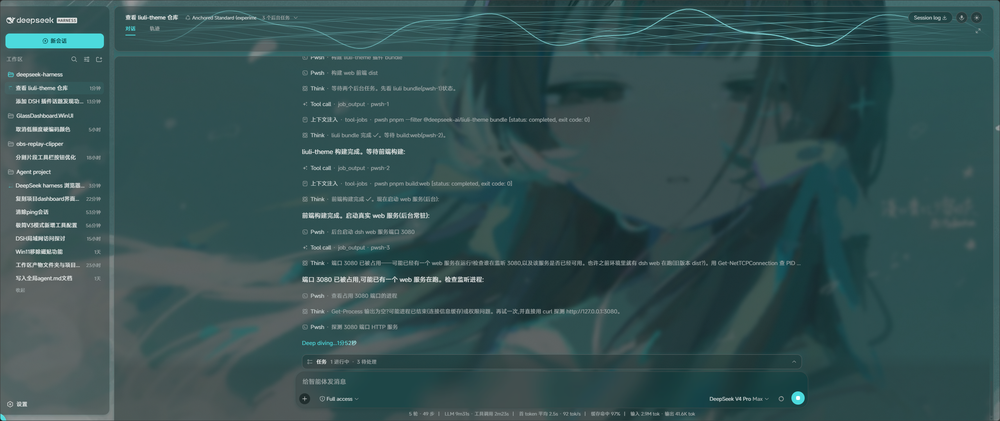

# 琉璃 · Liuli Theme

<p align="center">
  
</p>

DeepSeek Harness 的 **Material Design 3 × Fluent 2 融合主题**插件:取 Material 3 的
动态取色、形状系统与状态层,取 Fluent 2 的亚克力 / 云母材质与分层深度,壁纸磨砂、声纹可视化、日/夜圆形遮罩、
悬浮工具球——并打包为可独立安装、可 git 发布的浏览器插件。

> 包名 `@deepseek-ai/liuli-theme` · 版本 `0.1.0`
> 仓库:<https://github.com/LilycleHeart/liuli-theme.git>

## 预览

以下截图来自插件真实运行时的 DSH Web 界面:

| 开始页 · 亮色 | 开始页 · 暗色 |
| --- | --- |
|  |  |

| 动态取色变体 · 亮色 | 动态取色变体 · 暗色 |
| --- | --- |
|  |  |

| 会话页 · 暗色 |
| --- |
|  |

## 设计语言:Material 3 × Fluent 2

两个体系各取所长,避免风格打架:

| 设计维度 | Material Design 3 提供 | Fluent 2 提供 | Liuli 采用 |
| --- | --- | --- | --- |
| 色彩 | 从壁纸派生亮/暗两套动态调色板 | 表面随内容分层取色 | M3 动态取色 → `--dsw-alias-*` 令牌 |
| 材质 | 纯色 tonal surface | 亚克力、云母磨砂材质 | Fluent 亚克力 / 云母,含强磨砂档 `--denpa-material-blur-strong` |
| 形状 | 全圆、药丸与 20/20/4/20 气泡圆角 | 较小圆角的桌面窗口 | M3 形状系统(气泡明暗互换 `--dsw-specific-bubble-fg`) |
| 深度 | 分层阴影与状态层 | 窗口阴影 + 材质描边 | 两者叠加:材质卡 + M3 阴影层级 |
| 动效 | 状态层涟漪 | 平滑缓动 | Web `startViewTransition` 圆形遮罩承载日/夜切换 |
| 交互 | 组件状态与可访问对比度 | 桌面贴边吸附语义 | 悬浮球贴边半隐藏 + `Alt+Shift+E` 唤起 |

## 功能

| 模块 | 说明 |
| --- | --- |
| 🎨 M3 动态取色 | 从壁纸提取 Material 3 调色板(vendored material-color-utilities@0.4),映射为 `--dsw-alias-*` 令牌;亮/暗双主题独立派生,用户气泡明暗互换 |
| 🖼️ 壁纸背景 | 上传图片 → 压缩为 JPEG dataURL 持久化到 localStorage;适应模式(Cover / Contain / Stretch)+ 自定义选区(拖拽框选,Cover 下放大该区域);暗色遮罩随主题即时叠加 |
| 🪟 磨砂材质 | 亚克力 / 云母两种 Fluent 材质,透明度、模糊强度可调;含强磨砂档(滑条值 ×4,供对话框等嵌套 backdrop 采样衰减的场景) |
| 🔊 声纹可视化 | 会话 header 背景 canvas:空闲态品牌色流动波形;点击按钮经 `getDisplayMedia` 授权捕获系统扬声器输出(Web 端:共享「整个屏幕」并勾选「分享系统音频」;DSH Desktop 端:Host 半在 Electron 主进程安装 `setDisplayMediaRequestHandler`,直接授予系统回环音频 `audio:'loopback'`,点击即监听、无选择器);只监听系统音量,不降级麦克风;检测完全移植官方 Nanoleaf Desktop 音乐可视化(Energetic):能量包络对比节拍检测(Σx² vs 0.7s 滑动平均 + 200ms 冷却)+ 50-350Hz 低频脉冲(0.8×均值 + 220ms 冷却),两级强度(节拍 100%/脉冲 30%)叠加于三频段连续能量响应之上,波形绘制逐字参照 denpa_echo;失败给出「分享系统音频」勾选提示/授权/非安全上下文诊断 |
| 🌗 日/夜切换 | header 圆形按钮 + 设置页外观行,`startViewTransition` 圆形遮罩过渡(带坐标) |
| 📏 header 拉伸 | header 底部垂直拖拽手柄,高度记忆到 localStorage,刷新/切换会话自动恢复 |
| 📐 对话轮次刻度侧边栏 | DenpaPush 时间线风格:左侧竖线刻度,胶囊沿竖线滑动,显示该轮时间/commit号/摘要,点击刻度跳转对应轮次(仅 Chat 视图显示) |
| 💳 供应商额度显示 | header 标题区普通文本,跟在 agent preset 标签右侧:套餐供应商显示本月/本周/5小时三项额度,非套餐供应商显示余额;已内置 DeepSeek 余额(`/user/balance`)与 OpenCode Go 套餐(`/zen/go/v1/usage`),密钥经 Host `/liuli-quota` 路由从 credentials/env 读取,不进浏览器 |
| ⚪ 悬浮工具球 | 常驻悬浮圆点:贴边吸附半隐藏(JS 热区防抖动)、拖拽随行、打开后自动夹进视口;快捷键 `Alt+Shift+E` 唤起 |
| 🎯 元素选择器 | 悬浮球进入拾取模式后点击任意页面元素,生成引用 chip 插入当前会话输入框(`@` 触发源 + ReferenceCodec);发送后用户气泡中以简洁卡片展示,悬停展开详情 |
| 🎞️ 会话切换动画 | 切换会话/新消息入场效果(10 选 1):淡入/上浮/下沉/右滑/缩放/模糊/弹性/级联×2/关闭;插件内 MutationObserver 挂类,动画独立于宿主组件实现 |
| 🖥️ 右侧边栏(ZCode 侧边面板复刻) | 按 zcode-reverse 逆向源码逐功能对照实现的标签式侧边面板:48px 标签条(搜索标签页概览 + 可拖拽排序标签 + 新增标签下拉),标签类型 Treemapping(文件树)/仓库 Wiki/审查(Git 图谱)/浏览器(多实例,任意 http/https 网址+自动补全 scheme)/代码查看(图标取自 ZCode lucide 定义);关闭激活标签激活右邻、关闭最后一个标签收起面板、最近关闭上限 8、浏览器标签重开换新 id 并取页面标题;概览弹层加权搜索 + 相对时间;宽度左缘拖拽(min 240px/max 88%/默认 45%,持久化);`Ctrl/Cmd+Alt+B` 切换面板;浏览器面板元素拾取为显式开关;会话切换仅在切换当前会话时收起面板;文件树走 `/liuli-sidebar/*`,代码查看走 `/preview` iframe;命令中心 `Ctrl/Cmd+K` 含 切换面板/打开文件 等 16 条命令;标签可**拖入 Dockable 布局**(琉璃工作台/DockShell)拆分/停靠/合并:文件树/Git/Wiki/浏览器(带 URL)/代码查看(带路径)/终端/画板拖出即放入布局落点,移动语义(源标签关闭进最近关闭,可概览重开);拖到面板自身内部仍走内部排序 |
| 📝 对话页编辑 diff | 对话页 edit/write 工具行自动展开并显示文件 diff：上游 ToolRow 默认收起 + 当前 DSH 版本 result 视图/meta 缺失，琉璃按工具参数合成 hunks（window.__liuliDiffCache）注入 +/− 视图；轮次结束在对话流内嵌文件变更卡片（文件名 + DIFF 数量 + 审查/打开/展开打开方式：在资源管理器中打开 · 复制绝对/相对路径），点击审查直达右侧「审查文件」面板 |
| 📖 审查文件面板 | 右侧边栏「审查」标签由 Git 图谱改为审查文件：变更文件列表（git status）+ 选中文件的全文（/liuli-sidebar/file）与 Diff（/liuli-sidebar/diff）双视图；顶栏 打开 / 在资源管理器中打开（/liuli-reveal：explorer /select 等） / 复制绝对路径 / 复制相对路径 |
| 🌐 内嵌浏览器(ZCode Desktop IAB 复刻) | Electron 宿主内用 WebContentsView 承载真实 webview(独立会话分区 `persist:liuli-embedded-browser`、任意站点可开、弹窗自动转新标签、崩溃原位重建、favicon 同步);工具条与 ZCode 逐项对齐(前进/后退/刷新/地址栏/响应式视口 320..3840×2160 + fit..200% + 拖拽手柄/元素拾取/更多:外部打开+开发者工具);纯 Web 部署自动回退 iframe + `/liuli-proxy`;agent 自动化 CLI `scripts/browser-client.mjs`(open/goto/snap/click/fill/shot…)对应 ZCode browser-use 插件,详见 `docs/browser-use.md` |
| 🧩 Dockable Workspace(琉璃工作台) | 全屏 dockable 面板工作台,`Ctrl/Cmd+Alt+W` / header 按钮 / 悬浮球唤起;布局树(split 递归 + 标签组)纯函数模型 `dock-model.ts`(42 项单测 `demo/test-dock-model.ts` 全绿,含外部面板放置 `placePanel`):面板**拖拽**(pointer 命中判定 + 拖拽幽灵 + 落点指示器)、四向**拆分**(拖到面板边缘带)、**停靠**(拖到工作区边缘条/浮动窗口一键回收)、**浮动**(拖到空白区成窗,标题栏移动 + 右下角缩放)、**标签页合并**(拖到面板中心并入标签组,同组拖拽重排);面板注册表复用插件既有组件:文件树/Git 图谱/仓库 Wiki/终端/白板/代码查看/产物预览/内嵌浏览/便签(面板 state 随布局持久化);**保存/恢复 Workspace**:自动落 localStorage(250ms 防抖,刷新/HMR 重载原样恢复)+ 命名槽位保存/恢复 + JSON 导出/导入;sash 拖拽调比例(最小 12%);GUI 自测 `demo/verify-dock-gui.mjs`(无头 Chrome + CDP,D1..D15 覆盖全部交互含热重载存活) |
| 🪟 无边框模式兼容 | 兼容 DSH Desktop advanced（无边框/页面内标题栏）模式:桌面 shell 表面别名挂载上游结构类名(`liuli_frame`/`liuli_sidebarCol`/`liuli_centerCol`/`liuli_detailsCol`),浮动卡片/亚克力材质/壁纸/列留白等配方自动复用;另补表面透明、帧背景令牌迁移、macOS 红绿灯留白与侧栏内联宽度修正,观感与兼容模式对齐 |
| 🧱 Dockable 布局(现有布局停靠化) | advanced 模式下把桌面 shell 的既有三列布局**本身**改造成 dockable 工作台:琉璃以更低渲染优先级接管 root slot(`dock-shell-frame.tsx`,桌面 shell 保留子 slot 声明与 layout 服务),**侧边栏/会话/详情三大区域成为可拖拽面板** —— 拖拽(pointer 命中 + 幽灵 + 落点指示器)、四向拆分、边缘/面板内停靠、浮动窗口(移动/缩放/一键回收;无边框去掉 caption 行后改由 ⧉ 一键浮动——单标签面板悬停抓握簇、多标签 chip)、标签页合并、sash 缩放;详情区域与宿主 layout 服务双向联动(`openDetails/closeDetails` ⟷ 面板加入/移出右缘);扩展面板(文件树/Git/Wiki/终端/白板/代码/预览/浏览/便签)可混排;接受**右侧标签面板标签的 HTML5 拖入**(拖拽时显示落点指示,drop 即按落点拆分/合并/停靠,源标签移动进布局);**Workspace 保存/恢复**:dock 树自动落 localStorage + 命名槽位 + JSON 导出/导入,刷新/HMR 重载原样恢复;GUI 自测 `demo/verify-dock-shell-gui.mjs`(S1..S16 全交互含热重载存活) |
| 🎛️ 页面内窗口按钮 | 无边框模式三按钮(最小化/最大化·还原/关闭)移入页面:会话 header 最右端常驻 + 开始页固定窗口右上角的磨砂胶囊兜底(win32 已移除 32px caption 行,内容顶格铺满;该胶囊同时是窗口拖动区,承接原标题栏拖拽职能);经 Host `/liuli-window` 路由直驱 Electron 窗口(close=收进托盘,与原生同语义);Win+方向键贴边/双击拖动区最大化等系统行为保留 |
| 🔤 主题字体 | CSS `@import` 加载 MiSans / Inter / Space Grotesk / JetBrains Mono(字体族令牌早已引用,官方 harness 不注入 link,由插件自行加载) |
| ⚙️ 设置「界面」分区 | 20 项设置(取色/背景/材质/字体/圆角/泛光/阴影/宽边模式/壁纸适应与选区/会话动画),即时生效、自动保存 |

全部设置随浏览器持久化(`denpa:settings` / `denpa:wallpaper` / `denpa:header-height`);DSH Desktop 因每次重启 Web 端口会变(localStorage 按 origin 隔离),还会额外同步到 Host 端 `~/.liuli-theme/settings.json`,跨重启不丢失。

> **页面内窗口按钮(无边框模式)**:系统最小化/最大化/关闭三按钮移入页面——会话 header 最右端常驻、开始页兜底为标题拖拽条右上角的磨砂胶囊;动作经 Host `/liuli-window` 路由直驱 Electron 窗口(close 收进托盘,与原生同语义)。依赖对 DSH Desktop 的窗口参数补丁(`resources/app.asar.unpacked/lib/electron-runtime-*.js` 的 win32 advanced 分支:`titleBarStyle: "hidden" + titleBarOverlay` → `frame: false`),应用重启后生效;未打补丁时原生覆盖按钮仍在,页面内按钮与其并存。macOS 保持原生红绿灯不动。

### 供应商额度凭据

- **DeepSeek**：读取 `DEEPSEEK_API_KEY` / `DEEPSEEK_OFFICIAL_API_KEY`,请求 `https://api.deepseek.com/user/balance` 显示余额。
- **OpenCode Go**：读取 `OPENCODE_GO_API_KEY` / `OPENCODE_API_KEY`,请求 `https://opencode.ai/zen/go/v1/usage` 显示 5 小时 / 本周 / 本月套餐额度。

密钥只在 Host 侧 `/liuli-quota` 路由中通过 credentials/env 解析,不会进入浏览器 bundle。

## 安装

> **重要**：全新 DSH Desktop 安装时，只改 `cordis.patch.yml` 是不够的，必须同时把
> `@deepseek-ai/liuli-theme` 安装进 desktop profile 的 `package.json` 依赖，否则会报：
> `Cannot find package '@deepseek-ai/liuli-theme'`。

### 自动安装（推荐）

在插件源码目录执行：

```bash
# 本地源码安装（link 到当前目录）
pnpm install:desktop

# 或等发布到 npm 后，从 npm 安装
pnpm install:desktop:npm
```

脚本会：

1. 把 `@deepseek-ai/liuli-theme` 写入 `~/.dsh/profiles/desktop/package.json` 的 `dependencies`；
2. 确保 `~/.dsh/profiles/desktop/cordis.patch.yml` 注册了 `liuli-theme`；
3. 在 desktop profile 目录执行 `pnpm install`。

### 手动安装

```bash
# 1. 进入 desktop profile
cd ~/.dsh/profiles/desktop

# 2a. 已发布到 npm：
pnpm add @deepseek-ai/liuli-theme

# 2b. 本地源码：
pnpm add @deepseek-ai/liuli-theme@link:/绝对/路径/liuli-theme
```

然后确认 `~/.dsh/profiles/desktop/cordis.patch.yml` 里有：

```yaml
- insert:
    - id: liuli-theme
      name: '@deepseek-ai/liuli-theme'
```

最后重启 DSH Desktop。移除该注册行即回到素版外观（shell 的外观行降级为直连切换，无圆形遮罩）。

依赖宿主主题服务（`ctx.theme`，由 `dsh-client-ui-theme` 提供）：偏好持久化与 `theme/change` 事件由宿主承担，本插件只消费。host 半（node 半）提供两条本地路由：`/liuli-quota`（凭据额度）与 `/preview`（会话 cwd 静态站点，preview 面板用）。

## 构建

```bash
pnpm --filter @deepseek-ai/liuli-theme bundle
```

产出 `lib/index.js`(node 半)+ `lib/client.js`(浏览器半,closure-factory 产物)。
类型声明由 tsbuild 生成(`tsc -b packages/client/liuli-theme`,供 tsdown 打包入口引用)。

## 结构

```
packages/client/liuli-theme/
├── package.json              # 包声明:dsh.client.inject 平台模块、exports["./client"]
├── tsdown.config.ts          # clientBundle 预设(node 半 + 浏览器半)
├── docs/
│   ├── preview-start-light.png / preview-start-dark.png   # 开始页亮/暗真实截图
│   ├── preview-color-light.png / preview-color-dark.png   # 动态取色变体亮/暗
│   └── preview-session-dark.png                           # 会话页暗色(声纹/气泡/悬浮球)
├── src/
│   ├── index.ts              # node 半:注册 /liuli-quota(凭据额度)与 /preview(会话 cwd 静态服务)路由
│   ├── invariant.ts          # 包级 invariant 伴生(无运行时检查)
│   ├── denpa-settings.ts     # 20 项设置 schema 与默认值(类型 + schemastery + 防御合并)
│   └── client/
│       ├── index.ts          # 浏览器入口:CSS 注入 + 设置分区 + 事件桥 + header slots + 悬浮球 + 预览列
│       ├── denpa.css         # 主题令牌源(亮/暗双主题 + 铬色样式 + 圆形遮罩 + 入场动画)
│       ├── denpa-css.ts      # denpa.css 的字符串化拷贝(运行时注入 <style>,幂等;含字体 @import)
│       ├── denpa-store.ts    # 设置表单 store(ui-slots EngineStore)
│       ├── denpa-palette.ts  # M3 调色板 → DSH 令牌映射(含用户气泡明暗互换)
│       ├── denpa-runtime.ts  # 设置应用运行时(isDark 竞态保护 + seq 令牌 + 壁纸承载层)
│       ├── denpa-transition.ts # 会话切换/新消息入场动画(MutationObserver 挂类 + 级联延迟)
│       ├── DenpaAppearance.tsx / .module.css   # 设置页「界面」分区
│       ├── HeaderEffects.tsx / .module.css     # 声纹/监听/主题切换/拉伸手柄(单例引擎)
│       ├── supplier-quota.ts                    # 供应商额度适配层(适配器任务列表 + 通用 settings 识别 + 控制器)
│       ├── SupplierQuota.tsx / .module.css      # header 标题区额度/余额普通文本
│       ├── TurnRail.tsx / .module.css           # DenpaPush 时间线风格轮次刻度侧边栏
│       ├── FloatBall.tsx / .module.css / .types.ts  # 悬浮工具球 + 拾取模式
│       ├── PreviewPanel.tsx / .module.css       # ZCode 侧边面板壳:标签条/概览/新增/右键菜单/空状态 + 宽度覆盖 + header 切换按钮
│       ├── RightSidebarPanels.tsx / .module.css  # 侧边面板标签内容:命令中心/文件树/Wiki/Git
│       ├── SidePaneIcons.tsx                     # 侧边面板图标(lucide 路径取自 ZCode bundle,1:1)
│       ├── right-sidebar-api.ts                  # /liuli-sidebar/* Host 数据 API
│       ├── element-picker.ts # 元素选择器:selector/文本/矩形/颜色信息提取与序列化(支持 iframe 文档)
│       ├── element-card.ts   # 用户消息中的元素引用纯文本 → 卡片 DOM(MutationObserver 装饰)
│       ├── locales.ts        # denpa-appearance 文案(zh/en,键集完整性互检)
│       └── vendor/material-color-utilities.{js,d.ts}  # Material 3 取色库(vendored)
└── README.md
```

## 与宿主 shell 的配合(官方 harness 兼容)

主题完全自包含,只在官方 harness 已有的扩展点上挂载,不依赖任何未发布的自定义 slot 或组件改动:

- `dsh-client-ui-conversation`:header 的 `actions` / `utilities` 两个官方 slot 是全部 header 组件的挂点(声纹、主题切换、额度、拉伸手柄、回合导轨、预览按钮——组件把内容 portal 到自己的锚点,挂载点仅作生命周期)。会话切换动画不依赖宿主挂类逻辑:插件用 `MutationObserver` 直接在消息列(`[data-chat-flow]`)的新增节点上挂入场类。
- `dsh-client-ui-layout`:悬浮球是插件自有 overlay(独立 React root + fixed 定位);右侧边栏面板占用宿主 `details` 布局列(`priority: -1` 替换官方工具详情列),随布局动画从右侧展开/收起。
- `dsh-client-ui-theme`:Appearance 外观行点击时 dispatch `denpa:set-theme`(带坐标),由本插件的事件桥接 `startViewTransition` 圆形遮罩;桥未就绪时降级直连切换。
- `dsh-host-webserver`:node 半注册 `/liuli-quota` 与 `/preview` 两条前缀路由。
- 主题观感(令牌、材质、圆角、侧栏/设置浮层样式)全部在插件的 `denpa.css` 内以 CSS 变量与选择器覆盖实现,不改任一宿主组件源码。

## 许可

MIT

## Model Experience

### 元素选择器引用 chip

#### What the model sees

元素选择器生成的引用 chip 经 `@` 触发源与 `ReferenceCodec` 序列化后插入输入框,随用户消息提交,成为该消息中的模型可见引用内容。主题视觉、声纹、壁纸与 19 项设置只影响浏览器渲染,不进入任何模型请求。

#### Token effect

主题本身不占用 token;仅当用户把引用 chip 作为消息发送时,chip 携带的元素文本与标识计入该条用户消息的 token。

#### KV Cache effect

chip 内容随用户消息成为对话前缀的一部分,与普通用户消息同样参与后续 KV 缓存;主题渲染与 `denpa:*` 本地设置不改变 KV 缓存。

## Known Limitations and Deferred Work

- 纯浏览器插件,只在 web 平台生效;无头、ACP 等无界面的会话看不到主题效果。
- 纯 Web 部署下,设置、壁纸与 header 高度只存 `localStorage`,清除站点数据或更换浏览器/设备不会同步;DSH Desktop 部署会额外经 Host `/liuli-settings` 写入 `~/.liuli-theme/settings.json` 以跨 ephemeral 端口重启保留。
- 声纹监听只捕获系统音频,不降级麦克风:Web 端依赖 `getDisplayMedia` 用户授权(共享「整个屏幕」并勾选「分享系统音频」);DSH Desktop(Windows)由 Host 半安装 `setDisplayMediaRequestHandler` 直接授予系统回环音频(`audio:'loopback'`,点击即监听、无选择器),`audio: 'loopback'` 是 Electron 官方标注的 Windows-only 能力,其他平台的 Desktop 仍走默认 getDisplayMedia 行为。
- 壁纸以压缩 JPEG dataURL 持久化,受 `localStorage` 配额限制;超大原图会先压缩再保存。
- 会话切换动画是 DOM 观察层实现(消息节点挂类),并非宿主组件级动画:流式更新触发的部分节点重挂载也会再次入场,与宿主组件的缓存策略无关。
- 右侧边栏面板占用宿主 `details` 布局列,会替换官方工具详情列(工具调用详情不再显示在右侧列);`/preview` 与 `/liuli-sidebar` 路由只接受 loopback/同源 Host(局域网部署需额外配置信任域名,当前未开放该选项)。浏览器模式直接 iframe 加载 `localhost`/`127.0.0.1` 地址,若目标 dev server 未允许被 iframe 嵌入则可能显示空白;面板内的元素拾取要求 `/preview` 与页面同源(默认满足)。
- 会话侧栏行标记(官方 WIP 里有但未发布):官方树行不在 DOM 暴露会话 id,插件无法可靠对应具体会话,故本插件不提供该功能。
