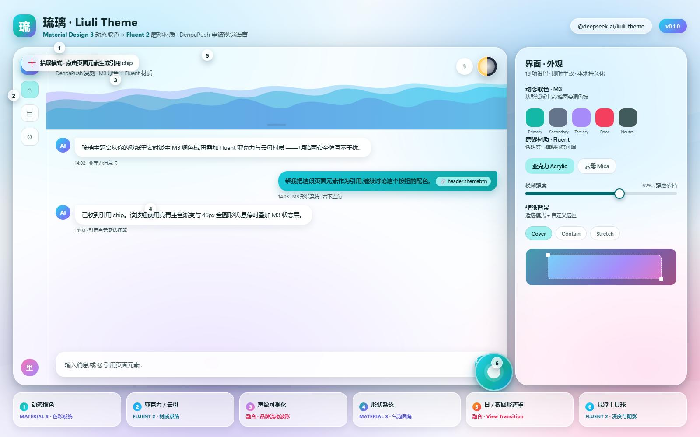
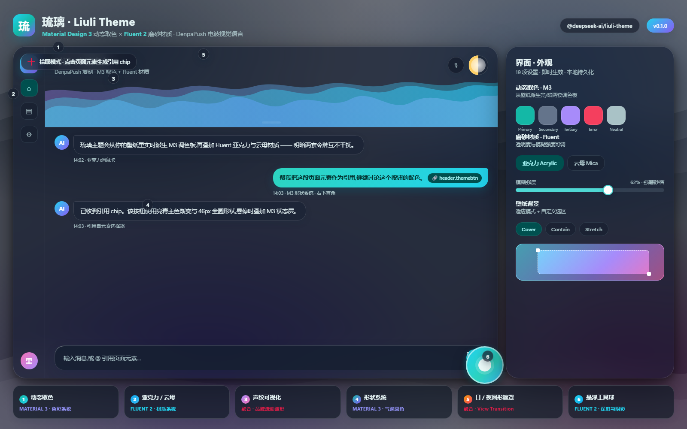

# 琉璃 · Liuli Theme

DeepSeek Harness 的 **Material Design 3 × Fluent 2 融合主题**插件:取 Material 3 的
动态取色、形状系统与状态层,取 Fluent 2 的亚克力 / 云母材质与分层深度,复刻
DenpaPush(电波推送)dashboard 的视觉语言——壁纸磨砂、声纹可视化、日/夜圆形遮罩、
悬浮工具球——并打包为可独立安装、可 git 发布的浏览器插件。

> 包名 `@deepseek-ai/liuli-theme` · 版本 `0.1.0`
> 仓库:<https://github.com/LilycleHeart/liuli-theme.git>

## 预览

| 亮色 · Light | 暗色 · Dark |
| --- | --- |
|  |  |

## 设计语言:Material 3 × Fluent 2

两个体系各取所长,避免风格打架:

| 设计维度 | Material Design 3 提供 | Fluent 2 提供 | Liuli 采用 |
| --- | --- | --- | --- |
| 色彩 | 从壁纸派生亮/暗两套动态调色板 | 表面随内容分层取色 | M3 动态取色 → `--dsw-alias-*` 令牌 |
| 材质 | 纯色 tonal surface | 亚克力、云母磨砂材质 | Fluent 亚克力 / 云母,含强磨砂档 `--denpa-material-blur-strong` |
| 形状 | 全圆、药丸与 20/20/4/20 气泡圆角 | 较小圆角的桌面窗口 | M3 形状系统(气泡明暗互换 `--dsw-specific-bubble-fg`) |
| 深度 | 分层阴影与状态层 | 窗口阴影 + 材质描边 | 两者叠加:材质卡 + M3 阴影层级 |
| 动效 | 状态层涟漪 | 平滑缓动 | Web `startViewTransition` 圆形遮罩承载日/夜切换 |
| 交互 | 组件状态与可访问对比度 | 桌面贴边吸附语义 | 悬浮球贴边半隐藏 + `Alt+Shift+E` 唤起 |

## 功能

| 模块 | 说明 |
| --- | --- |
| 🎨 M3 动态取色 | 从壁纸提取 Material 3 调色板(vendored material-color-utilities@0.4),映射为 `--dsw-alias-*` 令牌;亮/暗双主题独立派生,用户气泡明暗互换 |
| 🖼️ 壁纸背景 | 上传图片 → 压缩为 JPEG dataURL 持久化到 localStorage;适应模式(Cover / Contain / Stretch)+ 自定义选区(拖拽框选,Cover 下放大该区域);暗色遮罩随主题即时叠加 |
| 🪟 磨砂材质 | 亚克力 / 云母两种 Fluent 材质,透明度、模糊强度可调;含强磨砂档(滑条值 ×4,供对话框等嵌套 backdrop 采样衰减的场景) |
| 🔊 声纹可视化 | 会话 header 背景 canvas:空闲态品牌色流动波形;点击按钮经 `getDisplayMedia`(系统/标签页音频)授权后监听,真实频谱驱动柱状图与波形振幅;降级链 `getDisplayMedia → getUserMedia(麦克风)→ 非安全上下文诊断` |
| 🌗 日/夜切换 | header 圆形按钮 + 设置页外观行,`startViewTransition` 圆形遮罩过渡(带坐标) |
| 📏 header 拉伸 | header 底部垂直拖拽手柄,高度记忆到 localStorage,刷新/切换会话自动恢复 |
| ⚪ 悬浮工具球 | 常驻悬浮圆点:贴边吸附半隐藏(JS 热区防抖动)、拖拽随行、打开后自动夹进视口;快捷键 `Alt+Shift+E` 唤起 |
| 🎯 元素选择器 | 悬浮球进入拾取模式后点击任意页面元素,生成引用 chip 插入当前会话输入框(`@` 触发源 + ReferenceCodec) |
| ⚙️ 设置「界面」分区 | 19 项设置(取色/背景/材质/字体/圆角/泛光/阴影/宽边模式/壁纸适应与选区),即时生效、自动保存 |

全部设置随浏览器持久化(`denpa:settings` / `denpa:wallpaper` / `denpa:header-height`),不依赖服务端。

## 安装

插件随 Harness 客户端包构建;在 web-app 的浏览器插件清单(`cordis.patch.yml` 的 `dsh.client` 行区)加入:

```yaml
- id: liuli-theme
  name: '@deepseek-ai/liuli-theme'
```

宿主会从 `/plugins/@deepseek-ai/liuli-theme/client.js` 服务并自动加载。移除该行即回到素版外观(shell 的外观行降级为直连切换,无圆形遮罩)。

依赖宿主主题服务(`ctx.theme`,由 `dsh-client-ui-theme` 提供):偏好持久化与 `theme/change` 事件由宿主承担,本插件只消费。host 侧无任何行为(纯 UI 插件)。

## 构建

```bash
pnpm --filter @deepseek-ai/liuli-theme bundle
```

产出 `lib/index.js`(node 半)+ `lib/client.js`(浏览器半,closure-factory 产物)。
类型声明由 tsbuild 生成(`tsc -b packages/client/liuli-theme`,供 tsdown 打包入口引用)。

## 结构

```
packages/client/liuli-theme/
├── package.json              # 包声明:dsh.client.inject 平台模块、exports["./client"]
├── tsdown.config.ts          # clientBundle 预设(node 半 + 浏览器半)
├── docs/
│   ├── preview-light.png     # 亮色预览样例
│   └── preview-dark.png      # 暗色预览样例
├── src/
│   ├── index.ts              # node 半:空 apply(使插件进入宿主 Loader)
│   ├── invariant.ts          # 包级 invariant 伴生(无运行时检查)
│   ├── denpa-settings.ts     # 19 项设置 schema 与默认值(类型 + schemastery + 防御合并)
│   └── client/
│       ├── index.ts          # 浏览器入口:CSS 注入 + 设置分区 + 事件桥 + header slots + 悬浮球
│       ├── denpa.css         # 主题令牌源(亮/暗双主题 + 铬色样式 + 圆形遮罩动画)
│       ├── denpa-css.ts      # denpa.css 的字符串化拷贝(运行时注入 <style>,幂等)
│       ├── denpa-store.ts    # 设置表单 store(ui-slots EngineStore)
│       ├── denpa-palette.ts  # M3 调色板 → DSH 令牌映射(含用户气泡明暗互换)
│       ├── denpa-runtime.ts  # 设置应用运行时(isDark 竞态保护 + seq 令牌 + 壁纸承载层)
│       ├── DenpaAppearance.tsx / .module.css   # 设置页「界面」分区
│       ├── HeaderEffects.tsx / .module.css     # 声纹/监听/主题切换/拉伸手柄(单例引擎)
│       ├── FloatBall.tsx / .module.css / .types.ts  # 悬浮工具球 + 拾取模式
│       ├── element-picker.ts # 元素选择器:selector/文本/矩形/颜色信息提取与序列化
│       ├── locales.ts        # denpa-appearance 文案(zh/en,键集完整性互检)
│       └── vendor/material-color-utilities.{js,d.ts}  # Material 3 取色库(vendored)
└── README.md
```

## 与宿主 shell 的配合

主题是运行时注入的,但宿主 shell 保留了少量配套:

- `dsh-client-ui-conversation`:header 的 `.titleRow` 带 `position: relative; z-index: 1`,使插件注入的声纹背景 canvas(absolute, z-index: 0)铺满 header 而标题行浮于其上;`header.actions / header.utilities / header.tabs` 三个 slot 就是本插件四个 header 组件的挂点;对话页壁纸磨砂由 `ConversationRoot` 的 `.wallpaperBlur` 独立背景层承担——header 与 scrollBody 都保持无 backdrop-filter,否则会成为内部 composer 卡 backdrop-filter 的 backdrop root(Chromium 中嵌套采样被祖先截断);对话框(composer)的磨砂由 `InputBar` 卡片强磨砂档承担,滚动文字因此仍可被采样。
- `dsh-client-ui-theme`:Appearance 外观行点击时 dispatch `denpa:set-theme`(带坐标),由本插件的事件桥接 `startViewTransition` 圆形遮罩;桥未就绪时降级直连切换。
- `dsh-client-ui-sidebar` / `dsh-client-ui-settings`:侧栏与设置面板的亚克力磨砂、设置面板 portal 到 body(避开固定定位包含块陷阱)。
- `dsh-client-ui-primitives`:StateDot 状态点 halo/core 定位修正,done 态随主题色。
- 用户气泡明暗面互换经 `--dsw-specific-bubble-fg` 令牌,由 `dsh-client-ui-conversation` 气泡渲染消费。

## 许可

MIT

## Model Experience

### 元素选择器引用 chip

#### What the model sees

元素选择器生成的引用 chip 经 `@` 触发源与 `ReferenceCodec` 序列化后插入输入框,随用户消息提交,成为该消息中的模型可见引用内容。主题视觉、声纹、壁纸与 19 项设置只影响浏览器渲染,不进入任何模型请求。

#### Token effect

主题本身不占用 token;仅当用户把引用 chip 作为消息发送时,chip 携带的元素文本与标识计入该条用户消息的 token。

#### KV Cache effect

chip 内容随用户消息成为对话前缀的一部分,与普通用户消息同样参与后续 KV 缓存;主题渲染与 `denpa:*` 本地设置不改变 KV 缓存。

## Known Limitations and Deferred Work

- 纯浏览器插件,只在 web 平台生效;无头、ACP 等无界面的会话看不到主题效果。
- 设置、壁纸与 header 高度只存 `localStorage`,清除站点数据或更换浏览器/设备不会同步。
- 声纹监听依赖 `getDisplayMedia` 用户授权,拒绝后降级为麦克风或显示非安全上下文诊断,不会绕过授权。
- 壁纸以压缩 JPEG dataURL 持久化,受 `localStorage` 配额限制;超大原图会先压缩再保存。
